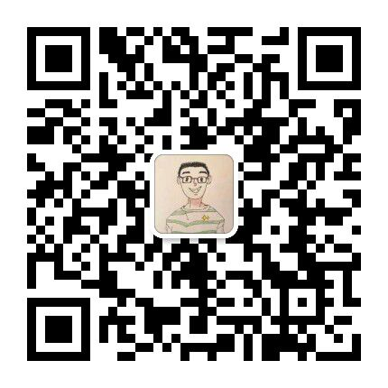

# 个人信息
- 姓名: 赵金健
- 邮箱: zhaojinjian0000@qq.com
- 微信/电话: 18809894652
- 求职意向: 计算机视觉算法岗
- 职业目标: 计算机视觉全栈工程师

# 教育背景
- 2020.9-2023.6  大连理工大学 信通专业 学硕（成绩85.43，推免，一等奖学金）
- 2016.9-2020.6  大连理工大学 信通专业 学士（成绩88.52，优秀毕业生）

# 实习经历
### 北京旷视科技有限公司（自动驾驶组 – 目标检测方向）(2022.3-2022.8)
- 背景：主要负责自动驾驶中的红绿灯、交通牌检测
- 网络结构实验：基于YOLOX，尝试ResNet18、Mobilenetv3、RepVGG（改通道数）；尝试添加SPP、SPPF模块，CSP-FuseFirst等；尝试CSP-FPN、PAFPN、BiFPN；尝试depthwise、重参数化进行轻量化。在项目数据集上，相比yolox_l，精度几乎不下降(0.2)，速度提高为2.7倍。
- 基建（数据增广）：交通灯场景的粘贴/泊松融合dataloader类（500行），并针对调参。
- 基建（训练忽略小目标）：训练时，重写Head，添加mask忽略小目标GT，不参与loss计算。
- 基建（计算指标忽略小目标）：匹配后，舍弃"与小目标GT的IOU最大且大于阈值的框”。
- 出现FP原因：统计与真值IOU=0与0<IOU<Threshold的FP的比例，来确定是分类或回归问题。
- 基建（callback）：写只加载backbone的预训练模型的callback函数；
- 负样本训练：使用无标签的干扰集参与训练，能减少FP，在项目数据集指标上涨1个点。
- YOLOv5实验：计算最佳anchor、添加P2层、添加数据增广、去掉尺度分布不一致的数据集等。
- 在YOLOX框架上，保存非EMA结果、添加只加载backbone预训练模型、从云端读取json文件和图片等功能
- 其他：数据集格式处理、数据分布可视化、可视化结果、修复gt数错误的bug、小目标检测报告等。

# 发表论文
### A Unified Approach for Tracking UAVs in Infrared             ICCV Workshop, 2021（一作）
- 单目标跟踪方向的论文，针对跟踪无人机时的相机快速运动或抖动、目标快速运动、出视野、尺度变化剧烈的情况，设计了一个统一的无人机跟踪框架，包括局部跟踪器、相机运动估计模块、边界框修正模块、重检测模块和更新模块。在9个跟踪数据集上的大量实验结果表明了我们框架的有效性和泛化性。

# 比赛经历
## （一）检测方向
### 检测 | 第4名 | 中国火箭军 [科技日报](http://www.sasac.gov.cn/n2588025/n2588139/c18952698/content.html)
- 背景：《火箭军“智箭·火眼”人工智能挑战赛按图索骥赛道》初赛第一，遥感场景，检测海面上的船。
- 结构：基于Res2Net101+Cascade RCNN，使用ROI Transformer处理旋转矩形框，添加DCNv2结构，Neck使用BiFPN替换FPN；
- 训练：在其他数据集上预训练，在比赛训练集使用旋转、多尺度、随机灰度化等数据增广微调；
- 测试：多尺度测试，使用FPN和BiFPN的模型进行WBF集成。
- 改进：Label Assignment部分改为分步计算，以减小内存消耗过大问题。

### 检测 | 第8名 | 极市平台 [排行榜](https://www.cvmart.net/race/10028/rank)
- 背景：《2021第二届珠港澳人工智能算法大赛》(获得周新星)，，指标同时考虑精度和速度。
- 方案：基于yolov5，tensort部署，写前处理+后处理代码对齐极市平台接口，Mosaic数据增广。
- 改进：修复tensorrtx中yolov5在训练过程中保存的模型精度低2个点BUG，是因为并没有使用EMA的结果。

### 检测 | 第14名 | 科大讯飞 [排行榜](http://challenge.xfyun.cn/topic/info?type=rich-detect-car)
- 背景：《2021年iFLYTEK A.I. 车内贵重物品检测》
- 方案：基于SwinTransformer+CBNetv2，Mosaic和Mixup数据增广、添加SWA。
- 改进：使用随机剪裁和混合精度训练减小显存消耗。

### 检测打榜 | 最高第1名 | 极市平台 [排行榜](https://www.cvmart.net/race/9924/rank) (行人检测)

### 检测 | Top 5% | 阿里天池 [排行榜](https://tianchi.aliyun.com/competition/entrance/531846/rankingList/0)(瓷砖瑕疵)

## （二）分类方向
### 分类 | 冠军 | 百度飞桨 [排行榜](https://github.com/PaddlePaddle/Paddle/issues/37401)
- 背景：《飞桨论文复现挑战赛（第六期）》PiT赛道，基于paddle复现论文
- 基于paddle，复现论文PiT，指标与论文对齐。

### 分类 | 第5名 | Kaggle [排行榜](https://www.kaggle.com/competitions/dlut-cv-project-image-classification/leaderboard)
- 背景：《DLUT CV Project : Image Classification》，小图片、长尾分布目标分类，参数量小于1.5M，计算量小于 250MFLOPs。
- 网络结构：尝试ResNet18(改)、MobileNetv3、GhostNet等结构。修改stride以适应小图片。
- 数据：使用CutOut、MixUp数据增广；
- 类别不均衡：尝试数据重采样、loss加权，最终使用在类别均衡子集上训练fc的策略；
- 训练策略：尝试warm up、cosine 学习率、标签平滑。
- 知识蒸馏：使用参数量大GhostNet作为教师模型蒸馏小的GhostNet；
- 优化算法：尝试RMSprop、Adam优化策略。

## （三）单目标跟踪方向
### 单目标跟踪 | 第10名 | ICCV Workshop [排行榜](https://anti-uav.github.io/leaderboard2/), [比赛总结](https://arxiv.org/abs/2108.09909)
- 背景：《The 2nd Anti-UAV Workshop & Challenge》，单目标跟踪快速运动的无人机。
- 背景运动补偿：针对相机运动，基于特征点匹配求解当前帧与过去帧的仿射变换矩阵，确定搜索区域。
- 二阶段法：引入二阶段判定，用AlphaRefine调整跟踪器的输出的回归框
- 模型更新：针对数据集特性以及新的运动补偿和二阶段模块，对模型更新策略进行调整。
- 重找回：用验证器判断是否跟丢，跟丢时使用GlobalTrack进行全局搜索。

# 项目经历
### 【导师项目】无人机自主跟踪系统
- 完成了一个统一行人跟踪框架：数据集读取支持6个格式的无人机跟踪数据集和demo视频输入；模型包括跟踪、相似度判断、检测、Reid模块；其他功能包括配置文件调参、各模块时间显存占用、统一tensorrt部署等（代码量2500+）。已在项目中持续使用。
- 为了实现无人机追踪地面上的（行人）目标，搭建了一个稳定的跟踪系统。首先基于单目标跟踪算法在搜索区域内定位目标，然后基于相似度判断是否跟丢，在跟丢时进行全局目标检测，并使用行人重识别找回目标。
- 对每个模块都选取了多种算法进行评估，在NVIDIA Jetson Xavier NX上使用Tensorrt部署。目前在UAV123中（类别为人的34个序列），速度达到43FPS，成功率达到0.95（IOU阈值设为0.5）。

### 【自学】MMDetection Contributor
- Fix mosaic coordinate error(5947)：定位并修复Mosaic数据增广处理矩形图片时的BUG。
- [Enchance] Add filter rules of Mosaic transform(5897)：定位并修复Mosaic数据增广单独使用时出现零面积框的BUG，并新增了滤除小目标的功能

### 【自学】从头写ViT等算法（飞浆课程）
- 基于paddle框架，从零写ViT等Transformer网络的网络结构

### 【导师项目】单目标跟踪器评估（用于综述论文，但尚未发表）
- 将6个不同格式数据集的格式统一，在27个跟踪器项目上，分别新增dataloader类，写多次测试取平均的代码，总计800+次测试。
- 写了一个统一的单目标跟踪指标计算框架，解决了pysot-toolkit和Got10k-toolkit在无人机跟踪场景指标不一致的问题（代码量500+）。

### 【自学】c++文字地牢探险游戏等4个大作业（深蓝学院课程）（代码量1000行+）

### 【导师项目】中国食品数据库构建（负责爬虫部分）

### 【本科毕设】自然场景下的文本识别

### 【课设】手势姿态估计+CoppeliaSim机械臂UR5仿真(控制左右摆动)

# 个人技能
- 研究方向 ：目标检测 > 分类 > 单目标跟踪 > 其他计算机视觉任务可快速上手
- 语言：熟练掌握Python；熟悉C++（深蓝学院c++优秀学员）；
- 深度学习：熟悉Pytorch，能复现学过的算法；熟悉Linux常用命令，了解shell脚本；
- 目标检测：熟练掌握目标检测中常见的codebase，如MMDetection、YOLOX等
- 其他技能：快速阅读英文论文；技术信仰、热爱编程；沟通执行力强；新领域快速学习；
